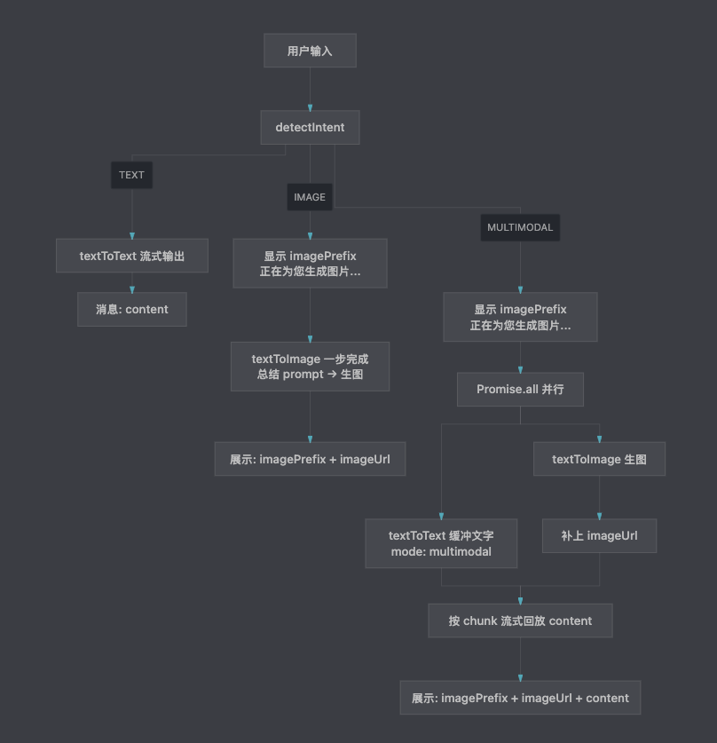
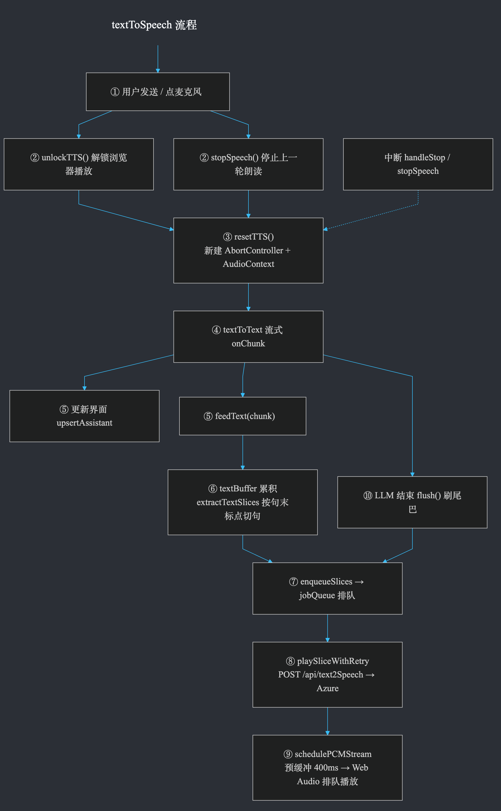

# Personal AI Agent

基于 Next.js 构建的个人 AI Agent。用户描述目标后，Agent 会先识别意图，再调用文字、图片、语音等多模态能力完成任务——而不只是简单的一问一答。

## 功能特性

- **意图识别**：自动判断任务类型（纯文字 / 生图 / 文字 + 图片）
- **文生文**：流式输出，支持多轮上下文
- **文生图**：根据任务上下文生成图片
- **语音输入（STT）**：浏览器录音，上传后转写为文字
- **语音播报（TTS）**：LLM 边输出边合成，按句排队无缝播放
- **任务中断**：支持停止生成与停止播报

## 架构概览

### 意图识别与多模态路由

用户提交任务后，Agent 通过 `detectIntent` 判断执行路径，再分别调用 `textToText`、`textToImage` 等能力：



| 意图 | 行为 |
|------|------|
| `TEXT` | 流式文字回复 |
| `IMAGE` | 生成图片并展示 |
| `MULTIMODAL` | 并行生成文字与图片，文字按 chunk 流式回放 |

### 流式 TTS 播报

文字回复过程中，系统将输出按句切分，调用 Azure Speech 合成音频，并通过 Web Audio API 排队播放：



## 技术栈

- **框架**：Next.js 16 · React 19 · TypeScript
- **样式**：Tailwind CSS 4
- **LLM**：OpenAI 兼容 API（文生文 / 意图识别 / 文生图）
- **STT**：OpenAI 兼容 API 或 SiliconFlow 等
- **TTS**：Azure Cognitive Services Speech

## 项目结构

```
app/
├── api/                  # 后端 API 路由
│   ├── detectIntent/     # 意图识别
│   ├── text2Text/        # 文生文（流式）
│   ├── text2Image/       # 文生图
│   ├── text2Speech/      # 文字转语音
│   └── speechToText/     # 语音转文字
├── hooks/                # useChat · useTextToSpeech · useSpeechToText
├── lib/                  # 前端 API 封装
├── pages/ChatBot/        # Agent 主界面
├── constants/            # 系统提示词、UI 文案
└── public/               # 静态资源（架构图等）
```

## 快速开始

### 1. 安装依赖

```bash
pnpm install
```

### 2. 配置环境变量

```bash
cp .env.example .env.local
```

按需填入以下配置：

| 变量 | 说明 |
|------|------|
| `LLM_API_BASE_URL` | LLM API 地址（OpenAI 兼容 `/v1`） |
| `LLM_API_KEY` | LLM API Key |
| `LLM_TEXT_MODEL` | 文生文 / 意图识别模型 |
| `LLM_IMAGE_MODEL` | 文生图模型 |
| `STT_API_BASE_URL` | 语音转文字 API 地址 |
| `STT_API_KEY` | STT API Key |
| `LLM_STT_MODEL` / `DEFAULT_STT_MODEL` | STT 模型 |
| `AZURE_SPEECH_KEY` | Azure Speech Key（TTS） |
| `AZURE_SPEECH_REGION` | Azure 区域，如 `eastasia` |
| `AZURE_TTS_VOICE` | 播报音色，如 `zh-CN-XiaoxiaoNeural` |

### 3. 启动开发服务器

```bash
pnpm dev
```

浏览器访问 [http://localhost:3000](http://localhost:3000)。

### 4. 构建与部署

```bash
pnpm build
pnpm start
```

## 常用命令

| 命令 | 说明 |
|------|------|
| `pnpm dev` | 启动开发服务器 |
| `pnpm build` | 生产构建 |
| `pnpm start` | 启动生产服务 |
| `pnpm lint` | 运行 ESLint |

## 开发说明

- 修改 UI 文案或组件后，若出现 Hydration 警告，可尝试硬刷新或 `rm -rf .next && pnpm dev` 清除 SSR 缓存。
- TTS 需在用户交互（发送 / 点击麦克风）后调用 `unlockTTS()`，以绕过浏览器自动播放限制。
- 语音输入依赖浏览器 `MediaRecorder` API，请使用 HTTPS 或 localhost 环境。
